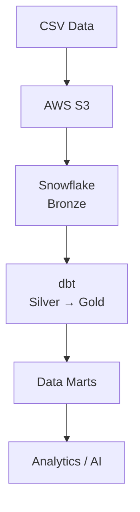

# Zomato - End-to-End Data Engineering Pipeline

An end-to-end Data Engineering project that builds a cloud-based ELT pipeline for Zomato restaurant and order data using AWS, Snowflake, dbt, and Airflow.

## Architecture



Apache Airflow orchestrates the pipeline from ingestion through transformation and validation.

## Tech Stack

- **Languages:** Python, SQL
- **Cloud:** AWS S3
- **Data Warehouse:** Snowflake
- **Transformation:** dbt
- **Orchestration:** Apache Airflow
- **Processing:** Pandas
- **AI:** OpenAI API
- **Application:** Streamlit
- **Infrastructure:** Docker

## Key Features

- Built an end-to-end ELT pipeline from raw CSV data to analytics-ready datasets.
- Implemented Bronze → Silver → Gold data architecture.
- Developed dbt models with incremental processing, dimensional modeling, and SCD Type 2 snapshots.
- Added dbt data quality tests including uniqueness, null, relationship, and accepted-value checks.
- Automated pipeline execution using Apache Airflow.
- Created analytical fact, dimension, and business-mart tables in Snowflake.
- Added an optional AI layer for review enrichment, RAG, and natural-language SQL.

## Pipeline Flow

```text
Source Data
    ↓
S3 Raw Layer
    ↓
Snowflake Raw Tables
    ↓
dbt Transformations
    ↓
Data Quality Tests
    ↓
Gold Data Marts
    ↓
Analytics / AI
```

## Project Structure

```text
├── airflow/       # Airflow DAGs and Docker setup
├── zomato/        # dbt models and transformations
├── snowflake/     # Snowflake setup and SQL scripts
├── ai/            # AI enrichment and analytics
├── docs/          # Architecture documentation
└── README.md
```

## Setup

### Prerequisites

- Python 3.x
- Docker
- AWS account
- Snowflake account
- dbt
- OpenAI API key (AI features only)

### Run dbt

```bash
cd zomato
dbt debug
dbt build
```

## Data Engineering Concepts

This project demonstrates:

**ELT** · **Data Lake** · **Data Warehouse** · **dbt** · **Airflow** · **Dimensional Modeling** · **Incremental Loads** · **SCD Type 2** · **Data Quality** · **Data Marts** · **AWS IAM**

> **Note:** Keep AWS, Snowflake, Airflow, and OpenAI credentials in environment variables or secret management. Never commit secrets to Git.
